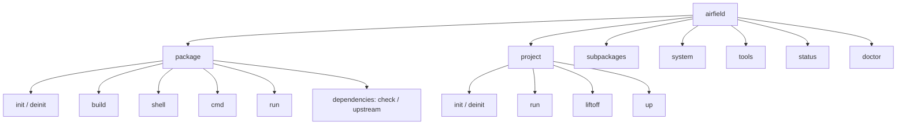
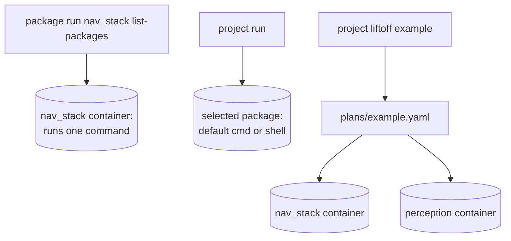

# Airfield: command tree ↔ project/package hierarchy

Supplementary diagrams for understanding how Airfield's namespaced commands map
to its project/package structure.

## 1. The two structures

### Project / package hierarchy (what lives on disk)

```
my_robot/                 PROJECT  ── the umbrella/workspace (airfield.yaml here)
├── airfield.yaml         project marker
├── packages/
│   ├── nav_stack/        PACKAGE  ── a buildable unit (its own airfield.yaml)
│   │   ├── airfield.yaml     name, ros_distro, dependencies, run: commands
│   │   └── src/              source mounted into the container at runtime
│   └── perception/       PACKAGE
│       ├── airfield.yaml
│       └── src/
├── dependencies/         shared dependency manifests, per target device
│   ├── x86_64/
│   └── arm64/
└── plans/
    └── example.yaml      PLAN ── a named list of packages to run together
```

- **Project** = workspace umbrella. Holds packages, shared deps, and plans.
- **Package** = the thing that becomes a container image and runs. Can also live
  standalone (no project) — that's why package commands accept `.`.
- **Plan** = a named group of packages (multi-package launch target).

### Command tree (what you type)



## 2. The link: namespace = which level it acts on

This is the key insight. The command's **namespace** tells you which level of the
hierarchy it touches.

```
COMMAND NAMESPACE              ACTS ON
────────────────────────────────────────────────────────────
airfield package ...    ──►    ONE package        (build it, run it, shell in)
airfield project ...    ──►    the WORKSPACE       (init it, or orchestrate
                                                    across packages via a plan)
airfield subpackages... ──►    the source repos inside packages
airfield system/doctor  ──►    your machine / context
```

## 3. run vs liftoff — one vs many

```
ONE package                              MANY packages
─────────────────────────────           ──────────────────────────────
package run <pkg> <cmd-name>             project liftoff <plan>
  runs one NAMED command from the          runs a whole PLAN — every
  package's run: map, in its                package listed in
  container                                 plans/<plan>.yaml, together

project run
  convenience: runs the selected
  package's `default` command,
  else opens a shell (still ONE)

(related) project up <plan>
  does NOT run anything — generates a tmuxinator session file from a
  plan. Add --launch to start tmux immediately.
```



Mnemonic: **run = launch one. liftoff = launch the whole stack (the rocket).**
