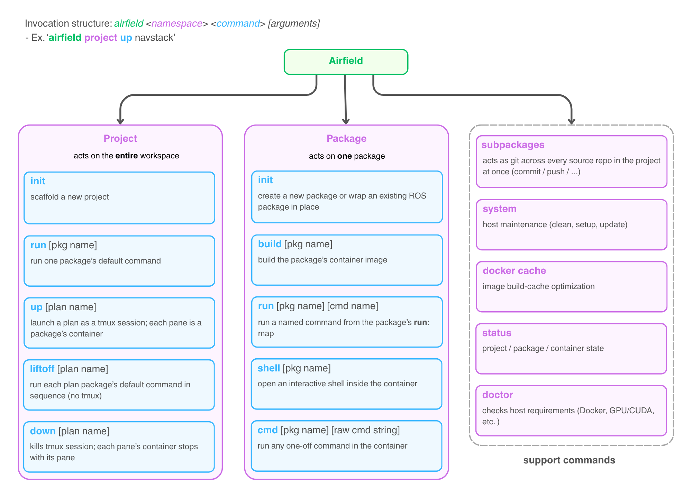
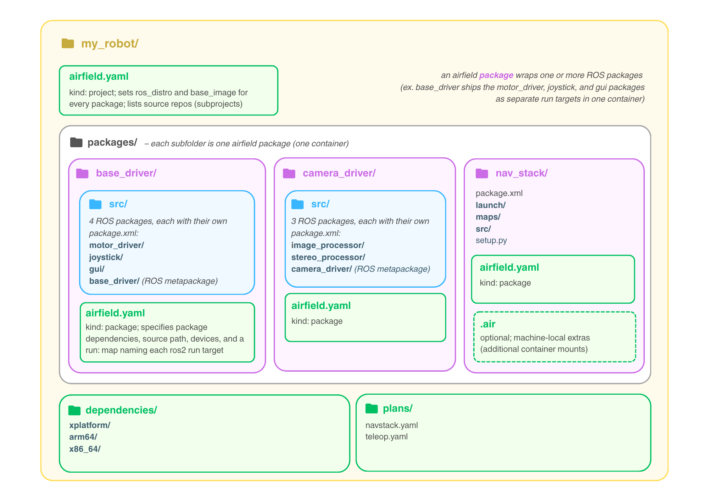
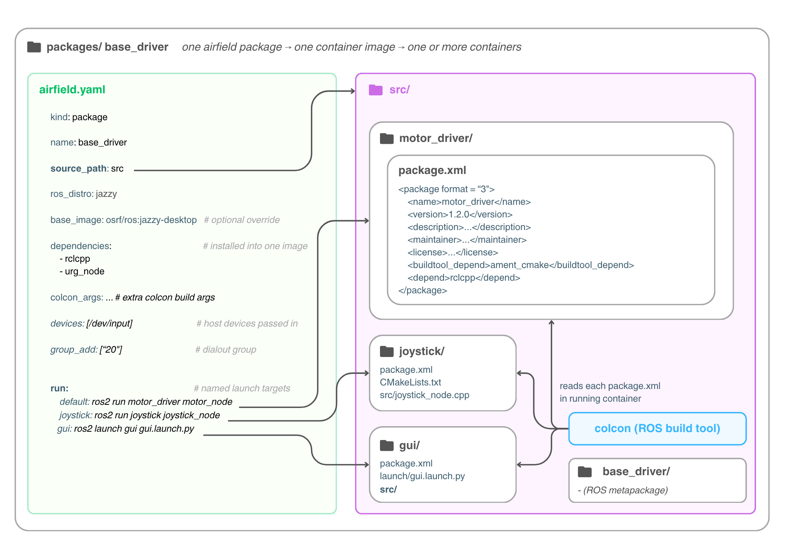
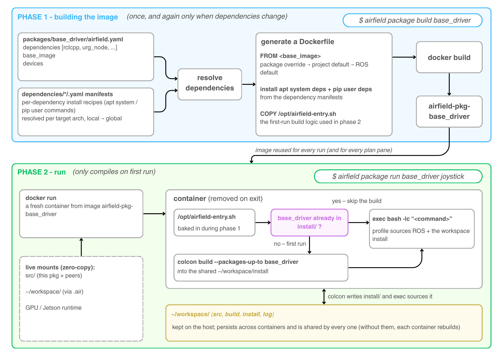
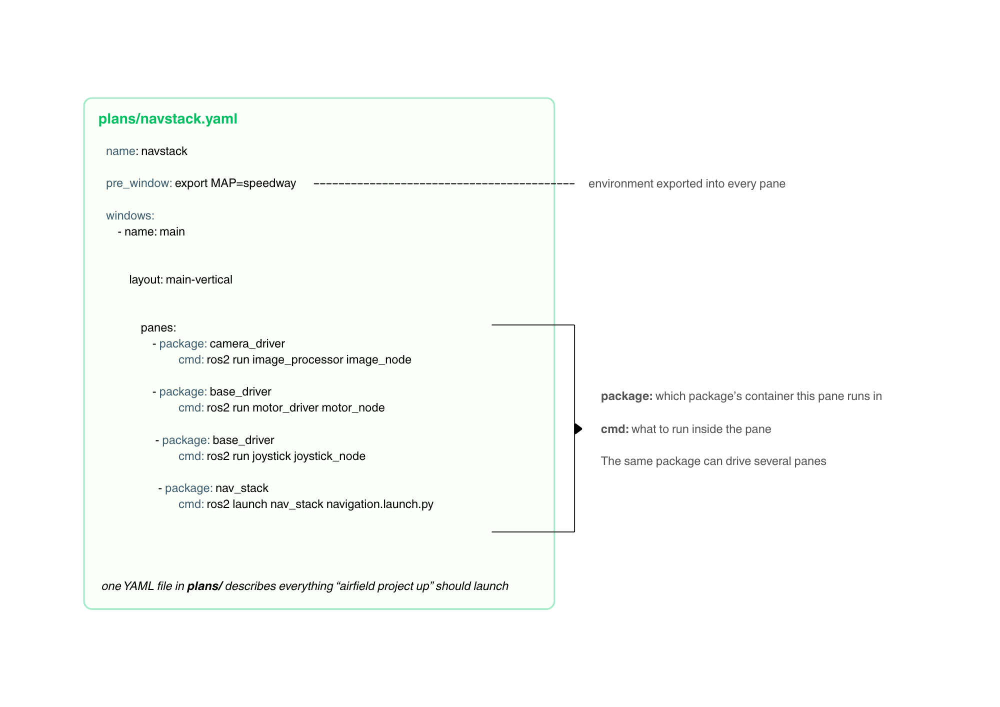
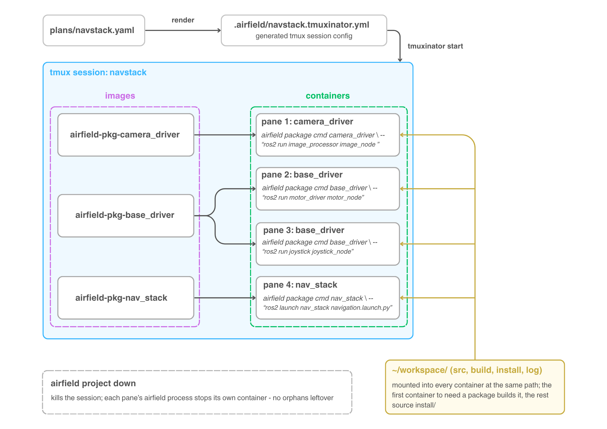

# Airfield — architecture overview

Airfield runs each part of a robot's ROS 2 stack in its own Docker container,
without changing how the ROS code itself is written or built. The six diagrams
below walk from the command surface down to what actually happens at launch
time. They are meant to be read in order — every diagram builds on the
vocabulary of the ones before it, and they all share one example project:
`my_robot/`, with three airfield packages called `base_driver`,
`camera_driver`, and `nav_stack`.

---

## 1. The command surface

Every invocation has the same shape: `airfield <namespace> <command>
[arguments]`. The two namespaces mirror airfield's two core nouns:

- **`project`** commands act on the whole workspace: `up` launches a plan
  (diagram 5) as a tmux session, `down` tears it down again, `liftoff` runs
  package defaults one after another without tmux, and `run` executes a single
  package's `default` target.
- **`package`** commands act on one airfield package: `build` produces its
  container image, `run` executes a named target from its `run:` map, `cmd`
  runs any one-off command inside the container, and `shell` drops you into an
  interactive shell there.
- The third column is support tooling. The one to know early is `doctor`,
  which checks host requirements (Docker, GPU/CUDA, …) before anything can
  fail mysteriously; `subpackages` acts as git across every source repo in the
  project at once.

Two conveniences the tree can't show: a `[pkg name]` argument can be omitted
when your shell is already inside that package's folder — airfield detects the
package from the working directory (`build` is the one exception: pass `.`).
And commands resolve by unique prefix, so `airfield pa b` is `airfield package
build`.

## 2. A project on disk

A project is a normal directory with four airfield-specific pieces at the
root:

- **`airfield.yaml`** (`kind: project`) — sets the `ros_distro` and default
  `base_image` that every package inherits, and lists the source repos that
  make up the project.
- **`packages/`** — each subfolder is one airfield package, and each airfield
  package becomes exactly one container image.
- **`dependencies/`** — one small YAML manifest per dependency, telling
  airfield how to install it (apt or pip), split by architecture (`arm64/`,
  `x86_64/`) with `xplatform/` for recipes that work everywhere.
- **`plans/`** — descriptions of what a full launch looks like (diagram 5).

The central idea in this diagram: **an airfield package wraps one *or more*
ROS packages.** `base_driver` bundles three (`motor_driver`, `joystick`,
`gui`); `camera_driver` bundles two; `nav_stack` wraps exactly one — its own
folder *is* the ROS package (`source_path: "."`), which is why its
`package.xml` sits at the top level right next to `airfield.yaml`. The rule of
thumb: containers isolate dependency *environments*, not ROS packages —
bundle ROS packages whose dependencies agree, and split out a separate
airfield package where dependencies diverge. Bundling costs no runtime
isolation: at launch each pane still gets its own container (diagram 6).

The extra `base_driver/` and `camera_driver/` folders marked *(ROS
metapackage)* are the glue that makes bundling work — they're explained in the
next diagram. The optional `.air` file holds machine-local extras (such as
additional container mounts) that belong to one machine rather than to the
shared package config.

## 3. Inside one airfield package

Zooming into `packages/base_driver/`: the left side is its entire
`airfield.yaml`; the right side is the source tree it points at.

- **`source_path`** names the folder colcon treats as workspace source. Here
  `src/` holds three completely ordinary ROS 2 packages, each with its own
  `package.xml` — airfield never modifies them. (When a package wraps a single
  ROS package, `source_path: "."` skips the inner folder entirely —
  `nav_stack` in diagram 2.)
- **`dependencies`** are installed into the package's one shared image
  (diagram 4); **`devices`** and **`group_add`** pass hardware through to the
  container (here `/dev/input` plus the dialout group for serial ports).
- **`run:`** gives memorable names to launch commands. Note that the targets
  invoke the *inner* ROS packages' executables (`ros2 run motor_driver
  motor_node`) — by the time these commands execute, the container is just a
  sourced ROS workspace.
- The fourth folder in `src/`, `base_driver/`, is a **ROS metapackage**: a
  `package.xml` with no code that only depends on the other three. It
  deliberately shares the airfield package's name — on first run airfield
  builds `colcon build --packages-up-to base_driver` (diagram 4), and that
  name match is what lets a single command build the whole bundle.

One naming trap: the `src/` at the top of the package (airfield's
`source_path`) is a workspace-style folder that holds whole ROS packages,
while the `src/` inside `gui/` is that ROS package's own C++ source folder.
Same name, unrelated jobs.

## 4. Build vs. run — the two-phase lifecycle

**Phase 1 — `airfield package build`** produces an *environment image*,
`airfield-pkg-base_driver`: a base image (package override → project default →
ROS-distro default), the apt/pip installs resolved from the dependency
manifests, and a small entry script. No ROS source is compiled into the image
— which is exactly why it only needs rebuilding when dependencies change.

**Phase 2 — every `run`/`cmd`/`shell`** starts a fresh, disposable container
from that image. Your source is live-mounted, so edits on the host are
instantly visible inside — no rebuild, no copy. The entry script then decides:
if `install/base_driver` already exists in the shared workspace, it skips
straight to your command; on first run it compiles with `colcon build
--packages-up-to base_driver` — this is where the metapackage from diagram 3
earns its keep, pulling all three bundled ROS packages into one build. Either
way it finishes by sourcing ROS plus the workspace `install/` and executing
the requested command.

The `~/workspace/` folder (`src`, `build`, `install`, `log`) lives on the host
and is mounted into every container of the package: the first container to
need a package compiles it once, and every later one — including every pane of
a plan (diagram 6) — just sources the result. Simultaneous first runs can't
collide; the build is serialized with a lock.

## 5. A plan: declaring a launch

A plan is one YAML file in `plans/` that describes everything `airfield
project up` should launch. `windows` split into `panes`, and each pane sets
two keys:

- **`package:`** — which airfield package's container this pane runs in
- **`cmd:`** — what to run there; it's a raw shell command executed inside the
  container, so it addresses the inner ROS packages directly (`ros2 run` /
  `ros2 launch`), just like the `run:` targets in diagram 3

`pre_window` is exported into every pane — the place for session-wide
environment like `MAP=speedway`. The same package may drive several panes
(`base_driver` appears twice here), which costs nothing extra: one image, two
containers, as the next diagram shows. A pane can also be left `null` to get a
plain shell inside the session — handy for debugging alongside the running
nodes.

## 6. Launch time: `airfield project up navstack`

`project up` renders the plan into a tmuxinator config
(`.airfield/navstack.tmuxinator.yml`) and starts it as a tmux session. Each
pane executes `airfield package cmd <package> -- "<cmd>"` — in other words,
every pane is exactly one phase-2 run from diagram 4, reusing the images from
phase 1.

Follow the fan-out in the middle: three images back four containers.
`base_driver`'s single image spawns two independent containers (panes 2
and 3) — bundling several ROS packages into one airfield package (diagram 2)
never sacrifices runtime isolation. All four containers mount the same
`~/workspace/`, so the first pane to need a package builds it and the rest
just source `install/`: **build once, launch many.**

`airfield project down` kills the session, and each pane's airfield process
stops its own container on the way out — no orphaned containers left running.
