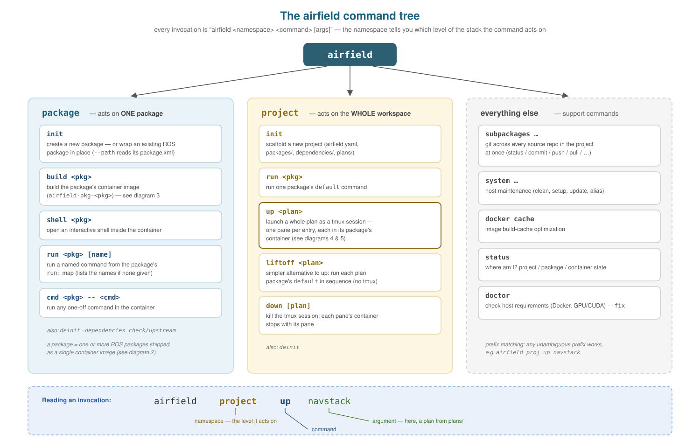
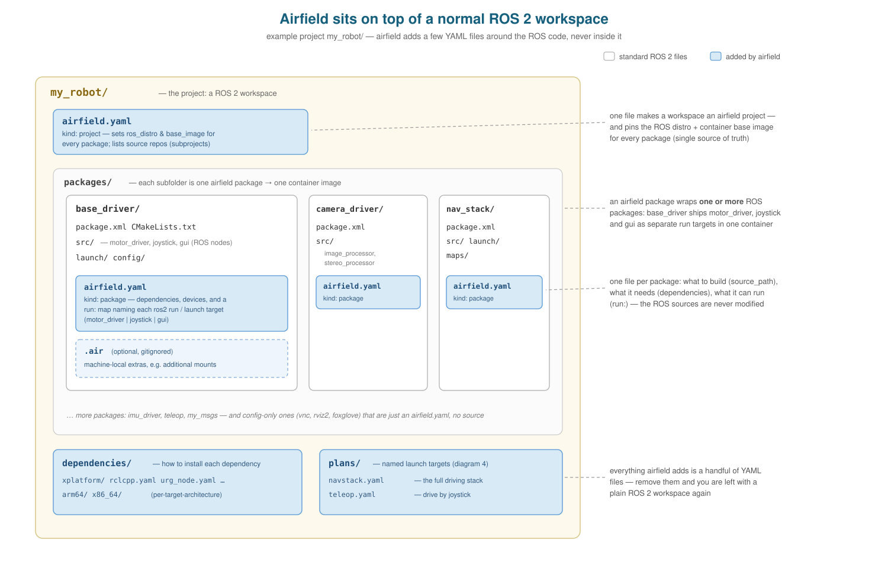
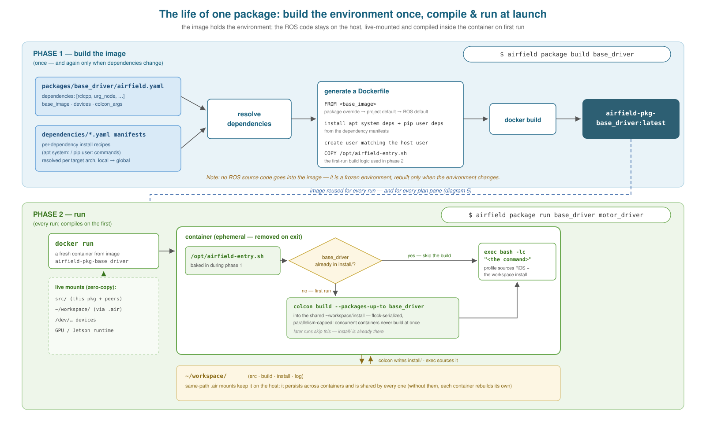
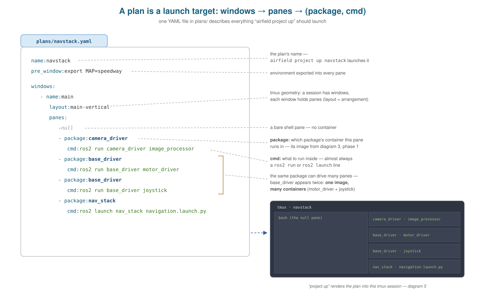
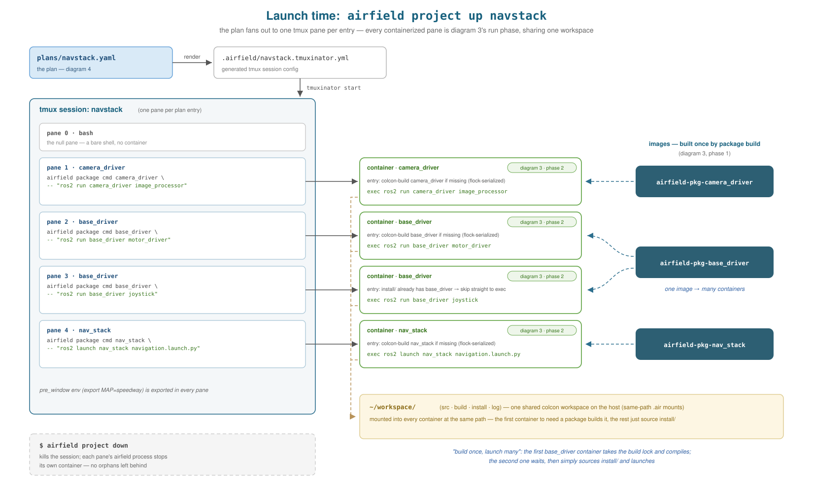
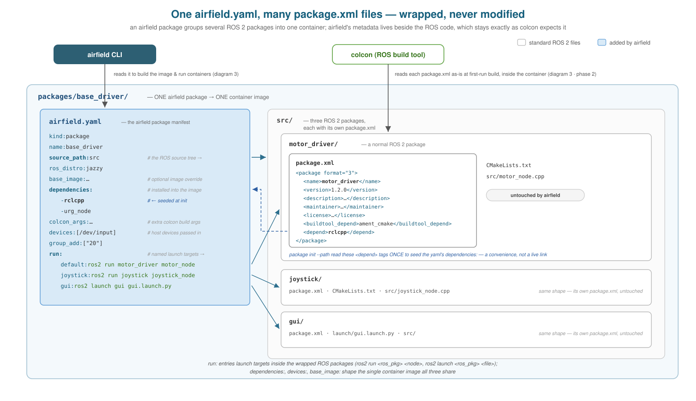

# Airfield — visual architecture guide

Six diagrams that explain airfield from the outside in: the command surface,
how it sits on a ROS 2 workspace, what happens when one package is built and
run, what a plan is, what happens when a whole plan launches, and how an
airfield package's metadata relates to the ROS packages it wraps.

All examples use a generic project (`my_robot/` with `base_driver`,
`camera_driver`, `nav_stack`) rather than any specific deployment. The color
language is consistent across all five:

| Color | Meaning |
|---|---|
| **Blue boxes** | files/config added by airfield (`airfield.yaml`, manifests, plans) |
| **Dark teal** | the airfield CLI and built container images |
| **Green** | containers and things that happen inside them at run time |
| **Cream/yellow** | the project/workspace and host-side state |
| **White/gray** | standard ROS 2 files, unmodified by airfield |

---

## 1. The command tree

Every invocation is `airfield <namespace> <command> [args]`. The namespace is
the key: `package` commands act on one package, `project` commands act on the
whole workspace (usually by orchestrating packages through a plan), and
everything else is support tooling. Peripheral commands are summarized; see
[overview.md](../overview.md) for the complete tree.

## 2. Airfield on top of a ROS 2 workspace

What a project looks like on disk. Each package folder holds a normal ROS 2
package (white) plus one `airfield.yaml` marker (blue) describing what to
build, what to install, and what it can run. The project root gets its own
marker plus `dependencies/` (install recipes) and `plans/` (launch targets).
Remove the blue files and a plain ROS 2 workspace remains — airfield wraps the
workspace, it never rewrites the code.

## 3. The life of one package: build vs. run

`airfield package build` produces an **environment image**: base image + the
apt/pip dependencies resolved from the manifests + the entry script. No ROS
source is compiled into it. The compile happens in **phase 2**: at run time the
source is live-mounted into a fresh container, and on first run the entry
script `colcon build`s the package into a shared host workspace
(flock-serialized so concurrent containers never build simultaneously — a
Jetson-class host would OOM). Every later run skips straight to the command.

## 4. Anatomy of a plan

A plan is one YAML file: `windows` → `panes`, where each pane names a
**package** (whose container to run in) and a **cmd** (what to run there).
The same package may appear in several panes — one image, many containers.
A `null` pane is just a bare shell.

## 5. Launch time: `airfield project up <plan>`

`project up` renders the plan into a tmuxinator config and launches it: one
tmux pane per plan entry, each running `airfield package cmd <pkg> -- "<cmd>"`
— i.e. each containerized pane is exactly diagram 3's run phase, reusing the
images from diagram 3's build phase. All containers mount the same host
workspace, so the first container to need a package builds it and the rest
just source `install/`: **build once, launch many**. `project down` kills the
session and every pane's container with it.

## 6. One `airfield.yaml`, many `package.xml` files

The two manifests side by side, fields included. `package.xml` is colcon's
file: it describes one ROS package and is read, unmodified, inside the
container at first-run build. `airfield.yaml` is airfield's file: it describes
the container around all of them — `source_path` points at the ROS source
tree, `dependencies`/`devices`/`base_image` shape the image, and the `run:`
map names launchable targets inside the wrapped ROS packages. The only
connection between the files is a one-time convenience: `package init --path`
reads the `<depend>` tags to seed `dependencies:`.

---

*The SVGs are hand-authored; edit coordinates directly or open them in any
vector editor. ASCII source wireframes live in
[airfield-architecture-diagrams.md](../airfield-architecture-diagrams.md).*
